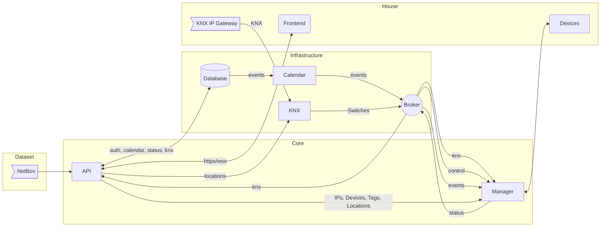

# Avorus

## Quick Start

For installation details, refer to the [Installation Guide](docs/install/README.md).

## Additional Documentation

For setting up individual components such as NetBox and probes, see the respective sections within the [docs/](docs) directory.

## Introduction

Avorus is a comprehensive software suite designed to bring advanced control and oversight to networked AV and digital media infrastructures. Crafted with attention to detail and a focus on functionality, Avorus addresses the technical demands of managing sizable installations with ease and precision.

## System Architecture

At the core of Avorus lie five primary services, which are orchestrated through a combination of MQTT messaging, enabled by the Mosquitto broker, and a centralized MongoDB database:

- API: The API service acts as the backbone of Avorus, interfacing with NetBox for data caching, providing the user interface, and facilitating communication between HTTP requests, WebSocket, and MQTT. It is also responsible for implementing access control across multiple users.
- Manager: This service is the operational brain behind device monitoring and controlling, receiving directives through MQTT and executing them via a range of protocols. It ensures device status updates are communicated back for display on the user interface.

- Calendar: A scheduling service within Avorus, it translates events set up through the UI into MQTT messages. These messages are sent to the Manager at specified times to ensure timely operational changes.

- KNX: By interfacing with KNX components, this service maps physical switch actions to MQTT messages, which then relay orders to bring devices to life or power them down according to needs dictated by the environment.

- FAC (Fire Alarm Center): A specialized service dedicated to safety, the FAC listens for SNMP traps indicating fire alarm activations and communicates this critical information to the Manager to undertake proper action.

The system housing Avorus includes:

- UI: A React-developed front end offering comprehensive views of the entire AV ecosystem, including locations, tags, devices, and error reporting. The user interface feeds into Avorus' system responsiveness, driven by intuitive design choices.

- Probe: Operating on the networked computers, this service communicates health and status metrics back to the Manager while also facilitating remote shutdown commands.

- Devices: These represent the varied hardware components such as projectors, screens, and any other networked AV equipment managed by Avorus.

All services employ Python's native asyncio library to ensure smooth concurrent operations without delays, showing Avorus' commitment to performance and reliability.

## Security and Performance

Constructed with a security-first approach, Avorus ensures all communication channels capable of encryption are secured via SSL, reinforcing the confidentiality and integrity of system interactions.

## Diagram Overview

## Conclusion

Avorus is an open-source tool that heightens the accessibility and manageability of AV and digital media hardware within complex environments.

With its modular architecture that accommodates real-world AV management needs, Avorus is ready to be deployed and extended by engineers and system architects who require a dependable and versatile system to maintain technological harmony in their workspaces.
